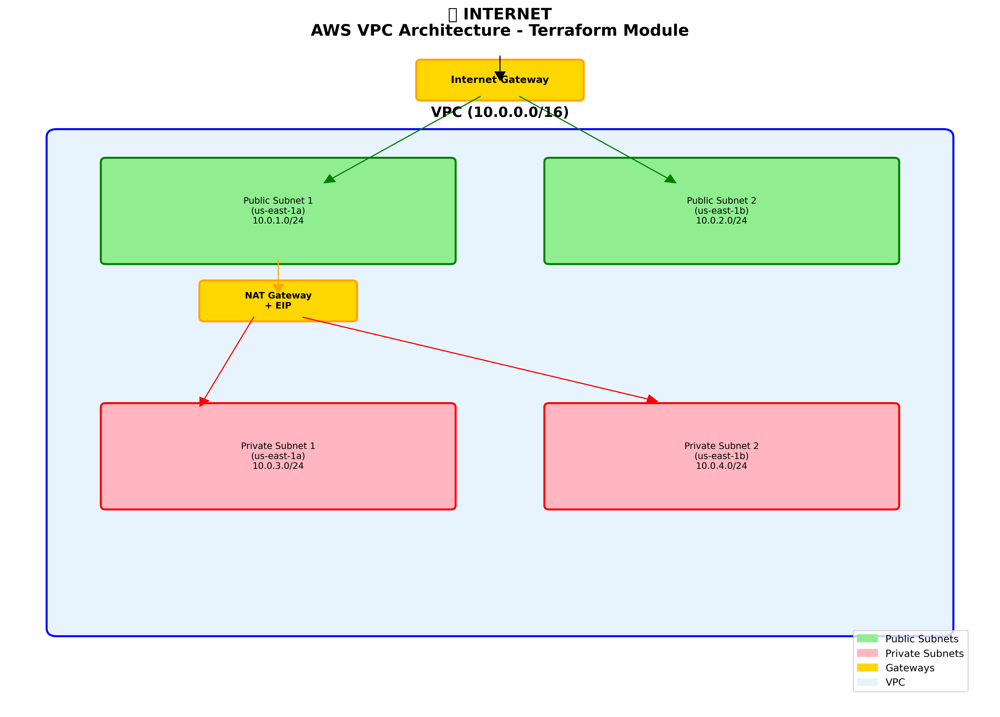

# VPC Terraform Module

## Arquitetura

Este módulo cria uma VPC completa na AWS com:

- **VPC** com CIDR customizável
- **Subnets Públicas** em múltiplas AZs com acesso direto à internet
- **Subnets Privadas** em múltiplas AZs com acesso via NAT Gateway
- **Internet Gateway** para conectividade externa das subnets públicas
- **NAT Gateway** com Elastic IP para saída de internet das subnets privadas
- **Route Tables** configuradas automaticamente
- **Security Group** padrão com regras básicas

## Fluxo de Rede

```
Internet
    |
    v
Internet Gateway
    |
    v
Public Subnets (Multi-AZ)
    |
    v
NAT Gateway (com EIP)
    |
    v
Private Subnets (Multi-AZ)
```



### Características:
- **Alta Disponibilidade**: Recursos distribuídos em múltiplas AZs
- **Segurança**: Subnets privadas isoladas da internet
- **Escalabilidade**: Configuração via variáveis
- **State Management**: Backend S3 com DynamoDB lock

## Arquivos

| Arquivo | Descrição |
|---------|-----------|
| `backend.tf` | Configuração do backend S3 e provider AWS |
| `main.tf` | Configuração principal da VPC |
| `vpc.tf` | Recurso da VPC |
| `vpc.public.subnet.tf` | Subnets públicas |
| `vpc.private.subnet.tf` | Subnets privadas |
| `vpc.internet.gateway.tf` | Internet Gateway |
| `vpc.nat.gateway.tf` | NAT Gateway |
| `vpc.public.route.tf` | Route tables públicas |
| `vpc.private.route.tf` | Route tables privadas |
| `vpc.security.group.tf` | Security Group padrão |
| `ec2.eip.tf` | Elastic IPs para NAT Gateway |
| `variable.tf` | Variáveis de entrada |
| `outputs.tf` | Outputs do módulo |

## Uso

```bash
terraform -chdir=./vpc init
terraform -chdir=./vpc plan
terraform -chdir=./vpc apply
```

## Outputs

- `vpc_id` - ID da VPC
- `public_subnet_ids` - IDs das subnets públicas
- `private_subnet_ids` - IDs das subnets privadas
- `public_route_table_ids` - IDs das route tables públicas
- `private_route_table_ids` - IDs das route tables privadas
- `security_group_id` - ID do security group